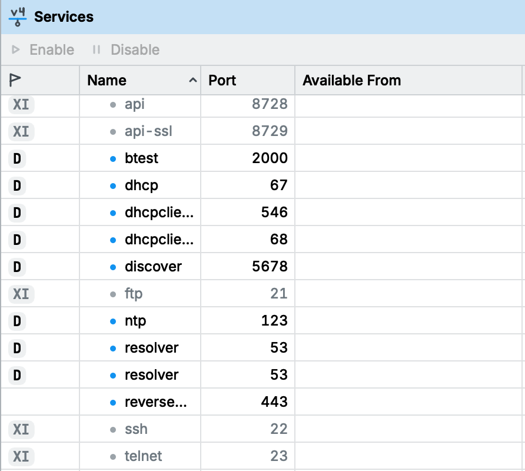
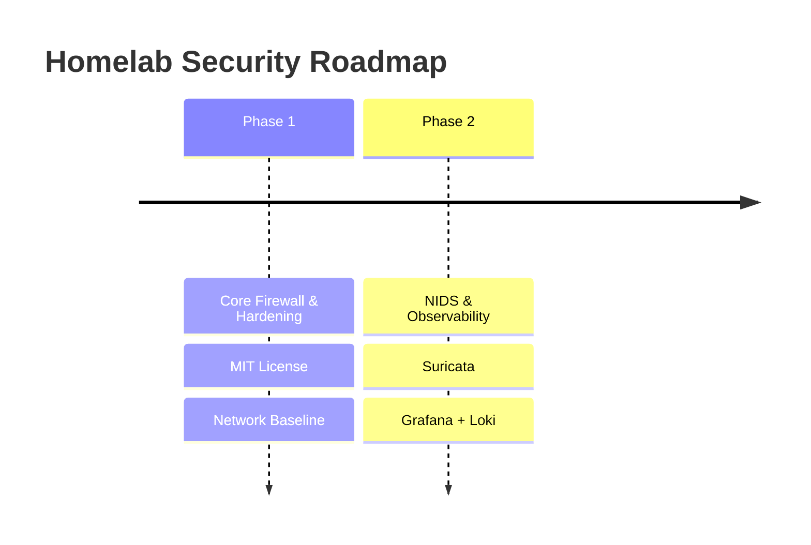

#  Homelab Cybersecurity Stack

A secure repository containing network configurations, security exports, and defensive stack policies for my homelab environment.

## Objective & Security Rationale

At a fundamental level, this hardening configuration prevents automated botnet scanners from probing open ports and exploiting low-hanging fruit. By closing unmanaged vectors and tightening perimeter filters, the router ignores public internet noise and eliminates default entry points.

## Environment Architecture

- **Hardware/Platform:** MikroTik RouterOS
- **Purpose:** Cybersecurity lab segmentation, traffic inspection, and firewall hardening.

## Visual Overview

Here is an overview of the firewall filter rules providing perimeter protection and traffic segmentation:

## Repository Structure

- `security-lab-export.rsc`: Sanitized MikroTik router configuration export featuring firewall rules, queue trees, interfaces, DHCP, and routing policies.

> 
> > **Note: Real-World Threat Landscape**
> 
> Before applying perimeter defenses, exposed network services are immediately targeted by automated botnets and malicious scanners across the public internet. 
> 
> When administrative interfaces and management ports are left exposed without proper firewall filtering, routers experience continuous, automated brute-force attacks. While the log entry below highlights unauthorized login failures via Telnet, similar aggressive scanning and credential-stuffing attempts occur across other exposed ports and services:
> 
> 
> 

## Service Hardening

Disabled high-risk, unencrypted, and unnecessary management services to minimize the router's attack surface:

* **Disabled Services**: Telnet (23), FTP (21), SSH (22), reverse-poxy (443), API / API-SSL (8728 / 8729), BTest (2000), www (80), www-ssl (443), and external Resolver (53).

 
 
 By enforcing a strict perimeter configuration—blocking unauthorized inbound traffic while explicitly allowing required ICMP, DNS, and dynamic DHCP lease management—the attack surface is eliminated, protecting the router from external compromise.

- [x] **Phase 1: Core Foundation & Hardening**
  - [x] Repository branding & asset management (`Images/`)
  - [x] Professional header design & tech-stack badges
  - [x] MIT License integration and legal compliance
- [ ] **Phase 2: Suricata / Grafana + Loki (NIDS) Setup**
  - [ ] Deploy Suricata Network Intrusion Detection System
  - [ ] Configure Loki for centralized log ingestion
  - [ ] Build Grafana security dashboards for real-time threat intelligence

## 🗺️ Project Roadmap

## 🤝 Contributing

Contributions, feedback, and security hardening recommendations are welcome! Feel free to open an issue or submit a pull request as the project evolves into Phase 2.

## 📄 License

Distributed under the MIT License. See [LICENSE](LICENSE) for more information.

  

